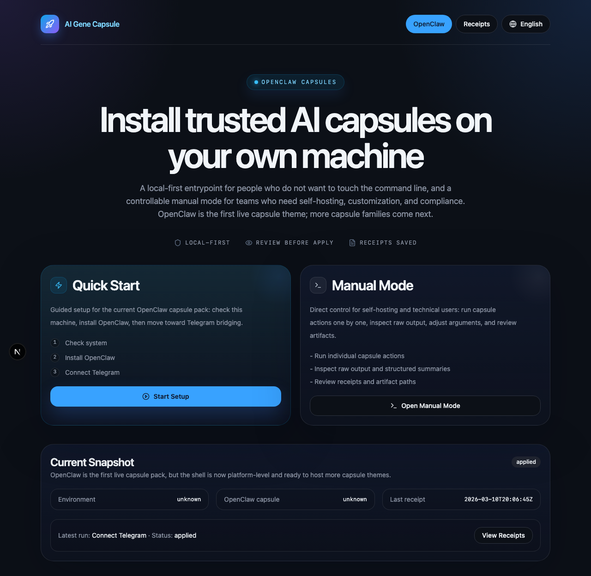

# AI Gene Capsule

<p align="center">
  
</p>

<p align="center"><b>Stop configuring. Start using.</b></p>

<p align="center">
  <a href="https://github.com/kamiimeteor/AI-Gene-Capsule/releases/latest"></a>
  <a href="https://github.com/kamiimeteor/AI-Gene-Capsule/releases"></a>
  
  
</p>

<p align="center">
  <a href="README.zh-CN.md">简体中文</a> · <b>English</b>
</p>

---

<p align="center">
  
</p>

You know what tools you need. You just don't want to spend hours reading tutorials, running terminal commands, and debugging config files to make them work together.

**AI Gene Capsule** turns multi-tool setup into a guided flow. It checks your system, installs what's missing, connects everything, and gives you a working result — no coding required.

## The Problem

Setting up AI tools locally often means:

- Reading 5 different docs for 5 different tools
- Copy-pasting terminal commands you don't fully understand
- Hitting errors you can't diagnose
- Spending 2+ hours before anything actually works

And that's if everything goes right the first time.

## The Solution

AI Gene Capsule packages the entire setup process into **capsules** — guided workflows that:

1. **Check** your system for what's already installed and what's missing
2. **Install** dependencies automatically, adapted to your specific machine
3. **Connect** tools together with the right configuration
4. **Verify** everything works with a confirmation step
5. **Give you receipts** so you know exactly what was done

The whole process: answer a few questions, wait 10 minutes, done.

## Download

| Platform | Architecture | Download |
|----------|-------------|----------|
| macOS | Apple Silicon (arm64) | [**Download v1.0.0**](https://github.com/kamiimeteor/AI-Gene-Capsule/releases/latest) |

> Intel macOS, Windows, and Linux coming soon.

### Install

1. Download the `.dmg` from [Releases](https://github.com/kamiimeteor/AI-Gene-Capsule/releases)
2. Open it and drag **AI Gene Capsule** to Applications
3. Launch **AI Gene Capsule** from Applications
4. If macOS shows a standard first-launch confirmation, choose **Open**

## What's Available Now (v1.0.0)

The first capsule: **OpenClaw + Telegram**

| Step | What it does |
|------|-------------|
| Environment Check | Scans your Mac for prerequisites and tells you exactly what's missing |
| OpenClaw Setup | Installs or verifies OpenClaw locally — no terminal needed |
| Telegram Bridge | Connects your Telegram bot with a guided flow (just paste your token) |
| Receipts | Shows you everything that was installed and configured |

### Screenshots

<p align="center">
  
</p>
<p align="center"><i>Pick Quick Start or Manual Mode</i></p>

<p align="center">
  
</p>
<p align="center"><i>Step 1 — Check your system for prerequisites</i></p>

<p align="center">
  
</p>
<p align="center"><i>Environment scan results — ready to proceed</i></p>

<p align="center">
  
</p>
<p align="center"><i>Step 2 — Review install plan before applying</i></p>

<p align="center">
  
</p>
<p align="center"><i>OpenClaw installed successfully</i></p>

<p align="center">
  
</p>
<p align="center"><i>Step 3 — Paste your bot token to connect Telegram</i></p>

<p align="center">
  
</p>
<p align="center"><i>Token entered, ready to connect</i></p>

<p align="center">
  
</p>
<p align="center"><i>All done — everything verified with full receipts</i></p>

## How It Works

```
┌─────────────────────────────────────────────────┐
│                 AI Gene Capsule                  │
│                                                  │
│   ┌──────────┐  ┌──────────┐  ┌──────────┐     │
│   │  Check   │→ │ Install  │→ │ Connect  │     │
│   │  your    │  │ what's   │  │ tools    │     │
│   │  system  │  │ missing  │  │ together │     │
│   └──────────┘  └──────────┘  └──────────┘     │
│         ↓                            ↓          │
│   ┌──────────┐              ┌──────────┐       │
│   │ Diagnose │              │ Verify & │       │
│   │ & Repair │              │ Receipt  │       │
│   └──────────┘              └──────────┘       │
│                                                  │
└─────────────────────────────────────────────────┘
```

Each capsule leverages your local environment and OS. It detects what you have, adapts to your setup, and only installs what's actually needed.

## Who This Is For

- You **know what result you want** but don't want to learn command-line tools to get there
- You're comfortable **paying for tools and APIs** but not comfortable debugging install errors
- You want things that **just work on your machine** — not another cloud subscription
- You've bought or installed AI tools before but **never actually configured them**

## What's Coming Next

| Capsule | What it sets up |
|---------|----------------|
| **Self-hosted AI Stack** | Ollama + Open WebUI + local models — fully private, no cloud |
| **Discord Bridge** | Connect AI to your Discord server |
| **Lark / Feishu Bridge** | Connect AI to Lark or Feishu workspace |
| **Team Dev Environment** | Git hooks + linters + formatters — one click for the whole team |

The goal: a library of capsules that turn "I want X" into a working local setup, without reading a single tutorial.

## Free & Paid

The desktop app is **free** and always will be.

What may become paid in the future sits above the local app:
- Hosted capsule registry with auto-updates
- Managed bridge hosting (always-on connections)
- Team features and shared configurations
- Cloud monitoring and audit trails
- Commercial support

## System Requirements

- macOS 14+ on Apple Silicon (arm64)
- Internet access during setup
- For Telegram bridge: a bot token from [@BotFather](https://t.me/BotFather)

Advanced users can verify the download checksum with [SHA256SUMS.txt](SHA256SUMS.txt).

## Troubleshooting

| Problem | Fix |
|---------|-----|
| macOS shows a first-launch confirmation | This is expected for a downloaded app. Choose **Open** to continue |
| Telegram doesn't send the first message | Open your bot in Telegram, tap **Start**, then retry |
| Bot token rejected | Make sure you pasted the full token including the number prefix and colon |
| Intel Mac, not Apple Silicon | arm64 only for now — Intel build coming soon |

## Links

- [Changelog](CHANGELOG.md)
- [Security policy](SECURITY.md)
- [Privacy policy](PRIVACY.md)
- [Contributing](CONTRIBUTING.md)
- [Code of conduct](CODE_OF_CONDUCT.md)

## Feedback

Found a bug? Need a new capsule? [Open an issue](https://github.com/kamiimeteor/AI-Gene-Capsule/issues).

## License

Proprietary — free to download and use. See [LICENSE](LICENSE).
